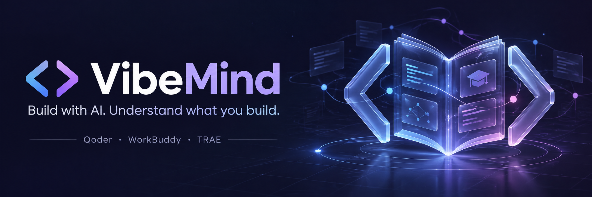

<div align="center">



<br/>

[](../README.md)
[](#)
[](README_JA.md)
[](README_FR.md)
[](README_DE.md)

<br/>

[](#installation)
[](#requirements)
[](../LICENSE)
[](https://www.ifdian.net/item/1a20ed042f0711f1865a52540025c377)
[](https://www.creem.io/payment/prod_1yc40mIhKwwrc7iqFOG9G2)

<br/>

**You shape the design. AI implements it. Understand the code you build.**

A learning companion for Qoder, WorkBuddy and TRAE, with a lightweight local CLI.

</div>

## What VibeMind does

VibeMind combines a learning-first Skill with reliable local state management. The Skill guides reasoning, explains unfamiliar concepts and implements clearly authorized designs. The CLI stores learning observations, a project map, knowledge cards and unfinished decisions.

Use the model and development tools you already have. Learning records stay in your project; no extra account, model API or background service is required.

## How learning works

Explain what you want and how you would approach it. Your agent checks that reasoning against the actual code and constraints, teaches missing concepts, discusses tradeoffs and implements the authorized scope.

Experience is inferred per topic from real conversation and work, rather than an opening questionnaire. Hearing an explanation is recorded separately from demonstrating that you can apply it. You can request suggestions, skip an exercise or ask for direct implementation.

<a id="requirements"></a>

## Requirements

- **Node.js 22.20.0 or newer**.
- An AI tool that can read project files and run local commands.
- The CLI uses only Node's standard library; installation through skills.sh also needs npx.

<a id="installation"></a>

## Installation

### Method 1: one sentence to your agent

Copy this instruction into your current agent:

```text
Read the README at https://github.com/TFboy1/VibeMind and install vibemind as a project skill for my current AI tool, check Node.js ≥22.20.0, keep all references, scripts and NOTICE files, preserve existing skills and learning records, leave global settings unchanged, and tell me how to enable learning.
```

The agent can use the skills CLI or the tool's native import flow. If it cannot complete a native import itself, it should explain the remaining user action accurately.

### Method 2: manual installation

#### Through the skills CLI

Open a terminal in the project you want to learn:

```sh
npx skills add TFboy1/VibeMind --skill vibemind --copy
```

Select your tool when prompted, or specify one:

```sh
# Qoder
npx skills add TFboy1/VibeMind --skill vibemind --agent qoder --copy

# Qoder CN
npx skills add TFboy1/VibeMind --skill vibemind --agent qoder-cn --copy

# TRAE CN
npx skills add TFboy1/VibeMind --skill vibemind --agent trae-cn --copy

# TRAE
npx skills add TFboy1/VibeMind --skill vibemind --agent trae --copy
```

Installation is project-scoped by default. `--copy` uses regular files, which is convenient on Windows. [skills CLI documentation](https://github.com/vercel-labs/skills)

#### Import the complete ZIP

1. [Download the VibeMind skill ZIP](https://github.com/TFboy1/VibeMind/releases/latest/download/vibemind-0.1.0.zip).
2. In WorkBuddy, open Skills → Add skill → Upload skill and import it. Qoder and TRAE can use the same ZIP through their native import UI.
3. Find `vibemind` and invoke it in your target project.

The ZIP must contain `SKILL.md`, `NOTICE.md`, `references/` and `scripts/` directly at its root. Keep the entire package. The full GitHub repository ZIP is different: the skill is inside `skills/vibemind/`.

The current skills CLI has no separate WorkBuddy target; use WorkBuddy's native importer. [WorkBuddy documentation](https://www.workbuddy.cn/docs/workbuddy/From-Beginner-to-Expert-Guide/Function-Description/Skills-Market)

For local source installation, clone the repository and supply its absolute path to `npx skills add`:

```sh
git clone https://github.com/TFboy1/VibeMind.git
npx skills add /absolute/path/to/VibeMind --skill vibemind --agent qoder --copy
```

Quote paths containing spaces on Windows.

## Start learning

In your project, ask:

> Use VibeMind to help me learn while building. I want to add inventory reservations to this Vue + FastAPI project. Inspect the existing code, then discuss my implementation approach with me.

Useful requests:

- “Explain this concept first.”
- “Skip this exercise and implement the agreed design.”
- “Review my knowledge cards about CORS.”
- “Pause learning.”
- “Resume VibeMind and continue unfinished decisions.”

Installing a Skill does not enable learning in every project. After activation, ordinary development requests retain the learning flow. A new conversation or tool switch requires explicitly invoking VibeMind again; automatic hooks are outside this first release.

A design confirmation records that design. It does not grant implementation permission for unmentioned work. Existing explicit authorization for the same scope is reused.

## CLI

Use the complete path to the installed script and explicitly select your project:

```sh
node skills/vibemind/scripts/vibemind.mjs --help
node skills/vibemind/scripts/vibemind.mjs init --cwd /path/to/project
node skills/vibemind/scripts/vibemind.mjs status --cwd /path/to/project
node skills/vibemind/scripts/vibemind.mjs context --cwd /path/to/project
node skills/vibemind/scripts/vibemind.mjs context --cwd /path/to/project --topic CORS
node skills/vibemind/scripts/vibemind.mjs pause --cwd /path/to/project
node skills/vibemind/scripts/vibemind.mjs resume --cwd /path/to/project
```

Read commands do not write records. `context` produces Markdown by default; add `--json` for JSON. Other commands return JSON. Errors go to stderr with a nonzero exit code.

`record` reads JSON from stdin. It requires the current `expectedRevision` and at least one update field: `profile`, `projectMap`, `cards` or `decisions`. Cards have stable `id`, `title` and `content`; decisions also have `stage`.

| Decision stage | Meaning |
|---|---|
| `reasoning` | Waiting for the user's reasoning |
| `design` | Waiting for design confirmation |
| `implementation` | Waiting for implementation authorization |
| `completed` | The current discussion node is finished; this alone does not mean code was implemented |

Cards and decisions are upserted by ID. Other records are preserved. Profile and map text replace their respective fields, so integrate still-valid observations before saving. [Detailed record contract](../skills/vibemind/references/records.md)

## Storage and recovery

`.vibemind/state.json` is the single source of truth; Markdown is generated when viewed. Each actual update increments the revision, backs up the previous state and atomically replaces the active file. Project locks and revision checks protect against stale concurrent writes.

Lookup respects Git and worktree boundaries and rejects symbolic-link state paths. All unfinished decisions are restored, including those after long histories.

- Add `.vibemind/` to your project's ignore rules if desired; the CLI does not edit them.
- On a revision conflict, reread and integrate the latest records before submitting.
- On a lock conflict, check for another writer. Remove a leftover lock manually only after confirming its process has exited.
- Corrupt or unsupported records are preserved and reported; `init` does not reset them.
- Backup or write failure preserves the old state. On lock-release failure, first inspect `status`, because the operation may already have saved.

There is no automatic reset or backup-restore command. Records enter your existing model's context when your host reads them; VibeMind does not upload them separately.

## Validation

```sh
node --check skills/vibemind/scripts/vibemind.mjs
node --test
npx skills add . --list
```

Tests use Node's built-in runner and temporary projects. They cover stable updates, readonly restoration, paused state, concurrent processes, corrupted data, backup/write failures, Unicode paths and project isolation. Teaching behavior should be checked in your own host: concepts should be explained directly, unfinished decisions retained, and hearing an explanation should not be marked as mastery.

## Sources and support

VibeMind borrows and adapts [VibeWise](https://github.com/nykooi1/vibe-wise) by Noah Kim: learner-owned design, direct concept teaching, checkpoint semantics, evidence-based learning records, project maps and unfinished-decision restoration. The project-boundary and backup design also draw on its implementation.

This project adds its Node CLI, versioned JSON storage, stable-ID knowledge cards, topic-specific reading and multi-host distribution. Source attribution and both MIT notices are included in [NOTICE.md](../skills/vibemind/NOTICE.md).

The support buttons above use the same destinations as the maintainer's [Academic Paper Writer](https://github.com/TFboy1/academic-paper-writer) project.
